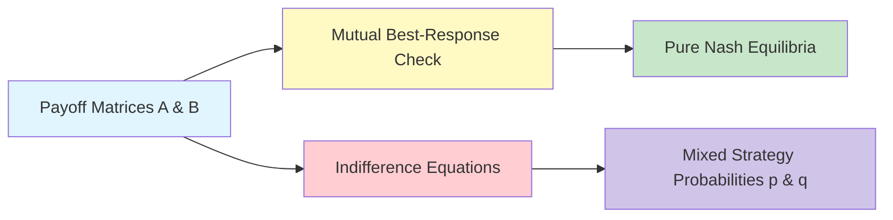

# GenPark Bimatrix Nash Equilibrium Solver Skill

Bimatrix normal-form game solver computing pure and mixed Nash equilibria.

Explore more at [GenPark](https://genpark.ai) and the [GenPark MCP Catalog](https://genpark.ai/mcp).

## Features
- Pure strategy Nash equilibrium detection across arbitrary finite bimatrix games.
- Exact mixed strategy indifference solving for 2x2 strategic games.
- Pure Python standard library.
